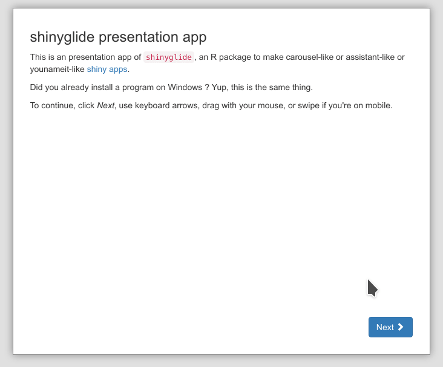

# shinyglide

<!-- badges: start -->

[](https://lifecycle.r-lib.org/articles/stages.html)
[](https://cran.r-project.org/package=shinyglide)
[](https://cran.r-project.org/package=shinyglide)
[](https://github.com/juba/shinyglide/actions)

<!-- badges: end -->

`shinyglide` is an R package which provides carousel-like or assistant-like components to [shiny](https://shiny.rstudio.com) applications, thanks to the [Glide](https://glidejs.com) JavaScript library.

It allows to create this sort of app:



Or can be integrated into an existing app to create an "assistant-like" interface:


## Features

-   Responsive, navigation by mouse, keyboard, swiping
-   Controls are completely customizable
-   _Next_ and _Back_ controls can be disabled until an input condition is met (same syntax as `shiny::conditionalPanel`)
-   "Screens" can be generated or hidden depending on user inputs. Loading time are taken into accounts (disabled _Next_ button and customizable animation)
-   Integration with Shiny modal dialogs
-   Multiple glides per app

## Installation

You can install the stable version with :

```r
install.packages("shinyglide")
```

And the development version with :

```r
remotes::install_github("juba/shinyglide")
```

## Usage

A `shinyglide` component is created with the `glide()` function. This component is then divided intro _screens_ with the `screen()` function.

Here is the code of a very basic app :

```{r}
library(shiny)
library(shinyglide)

ui <- fixedPage(style = "max-width: 500px;",
  titlePanel("Simple shinyglide app"),

  glide(
    height = "350px",
    screen(
      p("This is a very simple shinyglide application."),
      p("Please click on Next to go to the next screen.")
    ),
    screen(
      p("Please choose a value."),
      numericInput("n", "n", value = 10, min = 10)
    ),
    screen(
      p("And here is the result."),
      plotOutput("plot")
    )
  )
)


server <- function(input, output, session) {

  output$plot <- renderPlot({
    hist(
      rnorm(input$n),
      main = paste("n =", input$n),
      xlab = ""
    )
  })

}

shinyApp(ui, server)

```

For more information, see the three available vignettes :

-   [Introduction to shinyglide](https://juba.github.io/shinyglide/articles/a_introduction.html)
-   [Conditional controls and screen output](https://juba.github.io/shinyglide/articles/b_conditionals.html)
-   [Custom controls](https://juba.github.io/shinyglide/articles/c_custom_controls.html)

## Development notes

This package uses [packer](https://github.com/JohnCoene/packer) to manage JavaScript source code and dependencies. If you want to modify it, you'll need a working installation of [Node.js](https://nodejs.org/en/).

After cloning this repository, run the following in a terminal at the project root :

```sh
npm install
```

Then, if you modify the JavaScript code in `srcjs`, you'll have to run the following command to bundle and update the widget JavaScript code :

```r
packer::bundle_dev()
```

If you want to ship a minimized production version, use :

```r
packer::bundle_prod()
```

## Credits

-   [Glide](https://glidejs.com/) JavaScript library, by [Jędrzej Chałubek](https://github.com/jedrzejchalubek)
-   [packer](https://github.com/JohnCoene/packer) package by [John Coene](https://twitter.com/jdatap)
